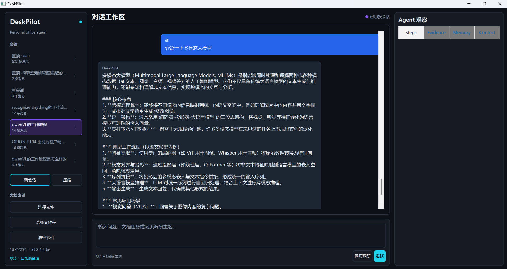

# DeskPilot

DeskPilot 是一个本地优先、面向个人办公场景的桌面 Agent。它将本地文档 RAG、会话记忆、网页调研、邮件处理、文件与终端工具、权限控制和多智能体编排整合到一个 PySide6 + Qt Quick 桌面应用中。

项目当前以“可运行、可审计、可评测”为目标：简单问题直接回答，单工具任务由语义路由器选择工具，复杂任务进入 Plan-and-Execute / Multi-Agent 流程；检索证据、计划、工具步骤、权限请求和上下文统计都可以在桌面端查看。

> 当前仍是个人项目和实验性 Demo，不应直接用于无人值守的生产环境，也不应在未检查权限策略的情况下处理重要邮箱或系统文件。

## 界面预览



## 主要能力

### 桌面对话与会话管理

- 使用 PySide6 + Qt Quick/QML 构建三栏桌面界面。
- 支持新建、重命名、置顶、删除和导出会话。
- 保存历史对话，切换会话后可恢复消息。
- 对话区支持鼠标滚轮、文本选择和复制，并以渐进方式展示长回答。
- 右侧面板展示 Agent Steps、引用证据、记忆和上下文统计。
- 高风险操作在聊天区域内请求确认，不依赖阻塞式系统弹窗。

实现入口：`deskpilot/qt_app.py`、`deskpilot/qml/Main.qml`、`deskpilot/memory/session_store.py`。

### 意图识别与 Agent 主流程

- 第一级判断 `direct_answer`、`tool_call`、`clarify` 或 `plan_task`。
- 第二级在 Tool Registry 中选择具体工具，并根据工具 Schema 填充和校验槽位。
- 简单问答和简单工具调用跳过 Planner，减少延迟与 Token 消耗。
- 只有多步骤依赖任务才进入 Planner，例如“搜索资料 -> 写报告 -> 作为附件发送邮件”。
- 本地索引只向 Router 提供有数量和长度限制的候选摘要，不发送全量文件名或全文。
- 对 LLM 路由结果增加结构、安全和证据一致性校验，避免无工具名调用、无索引候选误检索等问题。

实现入口：`deskpilot/core/agent.py`、`deskpilot/intent/`、`deskpilot/tools/tool_registry.py`。

### 本地文档 RAG

支持 `.txt`、`.md`、`.csv`、`.docx`、`.pptx`、`.xlsx` 和 `.pdf`。

当前 RAG 流程：

```text
文档解析
  -> 结构分块 / 语义分块
  -> Parent Chunk + Sentence Window 元数据
  -> Embedding 与 SQLite Catalog
  -> Query Analyzer / Query Rewrite
  -> Dense + SQLite FTS5/BM25
  -> RRF 融合
  -> Lexical / Cross-Encoder / ColBERT / API Reranker
  -> Sentence Window / Parent 上下文扩展
  -> 相关性阈值 + 覆盖感知 MMR
  -> Evidence 上下文
  -> LLM 回答
  -> 引用完整性校验与来源列表
```

主要实现：

- Markdown、Office 文档优先按标题、段落、列表、表格、页、Slide 或 Sheet 边界分块。
- PDF/TXT 支持基于相邻句 Embedding 距离的语义断点，并保留完整句 overlap。
- SQLite Catalog 保存文档版本、Chunk、Parent、Sentence Window、元数据、Embedding Cache 和 FTS5 索引。
- 小型个人知识库默认使用精确向量扫描，稀疏检索使用 SQLite FTS5/BM25。
- 多查询检索只在复杂任务触发；HyDE 已实现但默认关闭。
- RRF 后通过统一 Reranker 接口重排有界 child 候选；默认 `lexical` 零依赖实现，真实 Cross-Encoder 和 API provider 按配置启用，provider 故障自动回退 RRF。
- 事实/步骤问题使用 Sentence Window，总结/比较问题使用 Parent expansion；扩展不跨结构 parent，并受单条 Evidence token 预算约束。
- 最终以相关性阈值、显式文档覆盖、子查询覆盖和 MMR 选择证据，同 parent 窗口会合并。
- 回答必须引用真实 Evidence；会话记忆不能冒充文档证据。引用失败会尝试一次受限修订，仍失败才降级为本地证据摘要。
- API 不可用时可使用本地 hash embedding 和抽取式摘要维持基础 Demo。

实现入口：`deskpilot/rag/`。

### 会话记忆与上下文工程

- 原始消息以会话形式持久化，支持最近对话窗口和滚动摘要。
- 从对话中提取事实、偏好、决策、待办和产物等结构化记忆。
- Memory Gate 会跳过低价值的简单问答抽取，减少额外模型延迟；工具副作用、明确偏好/决策和有证据结果仍会进入抽取。
- 记忆具有 `pending`、`active`、`superseded`、`deleted` 等生命周期状态。
- 偏好与决策按稳定 `topic:*` 标签优先消解冲突；任务、产物和事实按类型与作用域设置默认 TTL，过期项不再参与检索。
- 低置信度信息进入待审批区；“不要记住”“只是举例”等内容会被过滤。
- 支持 SQLite 内置向量存储，也可选择 Chroma。
- Context Builder 按角色为 Router、Planner、Answer、Memory 等组件装配不同上下文。
- 使用 Token 预算、优先级、去重、相关性、压缩和淘汰机制控制长上下文。
- 记录上下文成本、截断情况和质量指标，防止历史助手幻觉进入 RAG Evidence。

实现入口：`deskpilot/memory/`、`deskpilot/context/`。

### 网页搜索与调研报告

- 支持 DuckDuckGo HTML、Bing API、Tavily API 和 Playwright Browser 四种搜索方式。
- 支持直接读取 URL、抽取网页正文、清理重复结果并将网页内容加入临时检索链路。
- 可生成带链接和引用来源的 Markdown 调研报告。
- Playwright 模式可复用本机 Chrome，也可以使用 Playwright Chromium 读取动态网页。

实现入口：`deskpilot/rag/web_research.py`。

### 邮件 MCP

- 支持 163、QQ、Outlook 及本地 Mock Provider。
- 支持查看最近/未读邮件、读取线程、搜索、分类和摘要。
- 支持创建回复草稿、保存服务器草稿、发送邮件和添加本地附件。
- 可选择邮件模板生成正文。
- 保存草稿和发送邮件都会进入人工确认流程。
- 发送后通过 SMTP 投递，并尝试将邮件同步到服务器“已发送”文件夹。

DeskPilot 内部 Tool Registry 直接复用邮件 MCP 业务层，因此启动桌面 Demo 时不需要另行启动 MCP Server。只有外部 MCP Client 通过 stdio 接入时，才需要单独运行 `deskpilot.mcp.email_server`。

当前环境变量只配置一个活动邮箱账号；多账号切换尚未实现。

实现入口：`deskpilot/mcp/`。

### 文件、代码、终端与桌面工具

已注册的主要工具包括：

- 文档定位、读取、文件夹扫描、分类和整理计划。
- 写入 TXT、Markdown、DOCX、PDF，支持覆盖和附件产物。
- 本地知识库检索和文件夹批量建索引。
- Python 代码执行，带超时、明显危险语法静态检查和人工确认；静态检查不是安全沙箱。
- Windows PowerShell / Linux Shell 命令执行，带白名单、风险分级、超时和工作目录限制。
- 获取活动窗口标题、打开文件/目录、打开 URL。
- 网页搜索、网页读取和主题调研。
- 邮箱读取、草稿和发送工具。

权限策略：

- 工作区安全目录内的新文件写入通常属于低风险。
- 覆盖文件、移动文件、修改安全目录外内容属于中高风险，需要确认。
- C 盘或工作区外写入会请求显式确认。
- Python 与高风险命令执行必须通过应用生成的一次性审批请求确认；LLM 工具参数不能自行授予权限。
- Shell 中明确的破坏性命令，以及 Python 中已识别的删除、子进程、动态执行和网络调用会被阻断；任意 Python 的完整隔离仍需容器或低权限执行环境。

实现入口：`deskpilot/tools/`。

### Plan-and-Execute 与多智能体

- Planner 先生成结构化执行计划和步骤依赖。
- MultiAgentRouter 根据任务复杂度、预计耗时、外部工具依赖和结果质量要求决定执行方式。
- 当前使用知识、执行和提交等较粗粒度角色，避免 Agent 划分过细。
- 邮件类“资料获取 → 正文生成 → 发送/草稿审批”复合任务已由 PlanExecutor 绑定节点 handler，并通过 Supervisor 执行依赖、重试、工具/Token/时间预算和人工确认状态。
- 其他计划任务仍由 Orchestrator 兼容执行链处理，将按工作流逐步迁移，避免一次性替换造成已有文件和 RAG 功能回归。
- 简单或实时任务不使用 Reflection；高质量、低实时性任务为后续 Reflection Agent 预留接口。
- 外部副作用仍由统一权限层和人工确认控制。

实现入口：`deskpilot/multi_agent/`、`deskpilot/core/runtime.py`。

## 技术栈

| 模块 | 技术 |
|---|---|
| 语言 | Python 3.11 |
| 桌面 UI | PySide6、Qt Quick、QML |
| LLM / Embedding | OpenAI-compatible HTTP API，默认示例为 DashScope/Qwen |
| 文档解析 | PyMuPDF、pypdf，以及基于 ZIP/XML 的 Office 文档解析 |
| RAG 存储 | JSON 兼容快照、SQLite Catalog、SQLite FTS5/BM25 |
| 记忆存储 | JSONL、SQLite、可选 Chroma |
| 浏览器 | Playwright，可复用 Chrome/Chromium |
| 邮件 | IMAP、SMTP、可选 MCP stdio Server |
| 测试与评测 | Python 回归脚本、152 条 DeskPilotBench、RAG P0/P1/P2 检索评测、GitHub Actions CI |

当前核心实现没有引入 LangChain、LlamaIndex 或 LangGraph，以便直接观察路由、检索、上下文和 Agent Loop 的内部行为。

## 目录结构

```text
deskpilot/
  context/              # 上下文构建、预算、压缩、成本和质量
  core/                 # Agent 主流程、模型客户端、配置和 Runtime
  intent/               # 语义路由、结构化 Schema 和槽位校验
  mcp/                  # 邮件 MCP 业务层和 stdio Server
  memory/               # 会话、结构化记忆、压缩和向量存储
  multi_agent/          # Planner、Router、Supervisor 和领域 Agent
  qml/                  # Qt Quick 界面
  rag/                  # 解析、分块、索引、检索和网页调研
  tools/                # 工具注册、权限、文件、桌面和执行工具
  qt_app.py             # Qt/Python 桥接层
eval/                   # 评测脚本、数据集、运行明细和报告
tests/                  # 模块和端到端回归测试
run_demo.py             # 桌面 Demo 入口
```

运行时数据默认写入 `data/`，包括索引、会话、记忆、报告和日志。该目录不应提交到版本库。

## 环境要求与安装

- Windows 10/11 或支持 PySide6 的 Linux 桌面环境。
- Python 3.11，推荐使用 Conda。
- 使用在线 LLM、Embedding、搜索或真实邮箱时需要网络连接。
- Playwright Chrome 模式需要本机安装 Chrome。

在项目根目录创建环境：

```powershell
conda create -p .\.conda\deskpilot-py311 python=3.11 -y
conda activate .\.conda\deskpilot-py311
python -m pip install -r requirements.txt
```

也可以不激活环境：

```powershell
.\.conda\deskpilot-py311\python.exe -m pip install -r requirements.txt
```

`requirements.txt` 中的主要依赖：

- `PySide6`：桌面 UI。
- `requests`：HTTP API 与网页请求。
- `PyMuPDF`、`pypdf`：PDF 解析与 PDF 写入。
- `playwright`：浏览器搜索和动态网页读取。
- `mcp`：可选邮件 MCP stdio Server。

可选依赖：

```powershell
# Chroma 记忆向量库
python -m pip install "chromadb>=0.5.0"

# Playwright 自带 Chromium；使用本机 Chrome 时通常不需要
python -m playwright install chromium

# 更精确的上下文 Token 统计，可任选其一
python -m pip install tiktoken
python -m pip install transformers
```

## 配置

复制配置模板：

```powershell
Copy-Item .env.example .env
```

`.env` 包含密钥和邮箱凭证，已被 `.gitignore` 排除，禁止提交。

### 模型配置

默认示例使用 DashScope 的 OpenAI-compatible API：

```env
DASHSCOPE_API_KEY=your_api_key
DASHSCOPE_BASE_URL=https://dashscope.aliyuncs.com/compatible-mode/v1
QWEN_MODEL=qwen3.7-plus
QWEN_EMBEDDING_MODEL=text-embedding-v4
QWEN_ENABLE_THINKING=false
ALLOW_LOCAL_FALLBACK=true
```

也兼容通用的 `LLM_API_KEY`、`LLM_BASE_URL`、`LLM_MODEL`、`EMBEDDING_API_KEY`、`EMBEDDING_BASE_URL` 和 `EMBEDDING_MODEL`。

模型 HTTP 请求对 429、502、503、504 和瞬时网络错误默认最多尝试 3 次，并使用指数退避。可通过 `LLM_API_MAX_ATTEMPTS`（1-5）和 `LLM_API_RETRY_BASE_SECONDS` 调整。

未配置 API Key 时，文档索引可降级为本地 hash embedding，RAG 回答降级为证据摘要；通用知识问答仍需要可用 LLM。

### RAG 与记忆配置

```env
MEMORY_VECTOR_PROVIDER=auto
CONTEXT_TOKENIZER_PROVIDER=auto
RAG_CHUNKING_POLICY=adaptive
RAG_HYBRID_ENABLED=true
RAG_MULTI_QUERY_ENABLED=true
RAG_HYDE_ENABLED=false
RAG_DENSE_PROVIDER=exact
RAG_DENSE_MIN_SCORE=0.08
RAG_P2_ENABLED=true
RAG_RERANK_PROVIDER=lexical
RAG_CONTEXT_EXPANSION_ENABLED=true
RAG_FINAL_TOP_K=6
RAG_MMR_LAMBDA=0.72
```

- `MEMORY_VECTOR_PROVIDER` 可设为 `auto`、`sqlite` 或 `chroma`。
- `RAG_HYBRID_ENABLED=false` 可回退到旧检索路径。
- 当前 Dense Provider 为小规模知识库的精确扫描，不是 ANN 向量数据库。
- `RAG_P2_ENABLED=false` 可回退到 P1 RRF；`RAG_RERANK_PROVIDER=disabled` 只关闭精排。
- `cross_encoder` 不会自动下载模型，必须在 `RAG_RERANK_MODEL` 配置本地模型目录。
- 完整分块、窗口、批处理和 RRF 参数见 `.env.example`。

### 网页搜索配置

```env
SEARCH_PROVIDER=duckduckgo
SEARCH_API_KEY=
SEARCH_ENDPOINT=
RESEARCH_MAX_RESULTS=5
BROWSER_CHANNEL=chrome
BROWSER_HEADLESS=true
BROWSER_TIMEOUT_MS=30000
SEARCH_ENGINE=bing
```

`SEARCH_PROVIDER` 支持 `duckduckgo`、`bing`、`tavily` 和 `playwright`。Bing/Tavily 需要对应 API Key；DuckDuckGo 和网页抓取的可用性受网络及站点反爬策略影响。

### 邮箱配置

本地开发建议先使用：

```env
EMAIL_PROVIDER=mock
```

QQ 邮箱示例：

```env
EMAIL_PROVIDER=qq
EMAIL_USERNAME=your_name@qq.com
EMAIL_PASSWORD=your_authorization_code
EMAIL_MAILBOX=INBOX
EMAIL_DRAFTS_MAILBOX=Drafts
EMAIL_SENT_MAILBOX=Sent
EMAIL_IMAP_PORT=993
EMAIL_SMTP_PORT=465
```

`EMAIL_PROVIDER` 还支持 `163` 和 `outlook`。163/QQ 的 `EMAIL_PASSWORD` 应填写客户端授权码，不是网页登录密码；需先在网页版邮箱开启 IMAP/SMTP。不同邮箱的草稿箱和已发送文件夹名称可能不同，应按服务器实际名称调整。

### 工具权限配置

```env
TOOL_SAFE_ROOTS=
TOOL_COMMAND_TIMEOUT_SECONDS=30
EMAIL_ATTACHMENT_MAX_MB=20
EMAIL_ATTACHMENTS_TOTAL_MAX_MB=25
```

`TOOL_SAFE_ROOTS` 使用分号分隔；为空时默认使用项目根目录和 `data/workspace`。扩大安全根目录会降低确认频率，也会扩大文件操作风险。

## 启动

```powershell
.\.conda\deskpilot-py311\python.exe run_demo.py
```

启动后可以：

1. 选择单个文件或文件夹建立本地索引。
2. 在聊天区进行通用问答、文档问答或自然语言工具调用。
3. 在 Steps 中检查 Router、Planner、Query Analyzer、检索 Trace 和工具结果。
4. 在 Evidence 中核对文件名、PDF 页码或网页链接。
5. 对写文件、执行命令、保存草稿和发送邮件等操作进行人工确认。

只有外部 MCP Client 需要单独启动邮件 Server：

```powershell
.\.conda\deskpilot-py311\python.exe -m deskpilot.mcp.email_server
```

## 测试

编译检查：

```powershell
.\.conda\deskpilot-py311\python.exe -m compileall -q deskpilot eval tests
```

关键回归脚本不强制依赖 pytest，可以直接运行：

```powershell
.\.conda\deskpilot-py311\python.exe tests\test_agent_runtime.py
.\.conda\deskpilot-py311\python.exe tests\test_intent_router.py
.\.conda\deskpilot-py311\python.exe tests\test_memory_p0.py
.\.conda\deskpilot-py311\python.exe tests\test_memory_p1.py
.\.conda\deskpilot-py311\python.exe tests\test_rag_p0.py
.\.conda\deskpilot-py311\python.exe tests\test_rag_p1.py
.\.conda\deskpilot-py311\python.exe tests\test_rag_grounding.py
.\.conda\deskpilot-py311\python.exe tests\test_tool_registry.py
.\.conda\deskpilot-py311\python.exe tests\test_email_mcp.py
.\.conda\deskpilot-py311\python.exe tests\test_multi_agent_p0.py
```

DeskPilotBench 离线模式不会调用真实模型、网页或邮箱：

```powershell
.\.conda\deskpilot-py311\python.exe -m eval.run_eval --count 20 --mode offline
```

使用真实模型 API 或运行单例：

```powershell
.\.conda\deskpilot-py311\python.exe -m eval.run_eval --count 20 --mode api
.\.conda\deskpilot-py311\python.exe -m eval.run_eval --case-id reg_rag_route_005 --mode api
```

RAG 检索层消融：

```powershell
.\.conda\deskpilot-py311\python.exe -m eval.run_rag_p0_eval --count 8
.\.conda\deskpilot-py311\python.exe -m eval.run_rag_p1_eval --mode offline --strategy all
.\.conda\deskpilot-py311\python.exe -m eval.run_rag_p2_eval --count 12 --mode offline --provider auto --expansion auto
```

评测报告默认写入 `eval/reports/`，逐用例明细写入 `eval/runs/`。报告和运行结果属于生成产物，不应提交。

## 数据与安全

- `.env`、邮箱密码、授权码和 API Key 不得提交。
- `data/` 包含本地索引、会话、记忆和用户文档派生产物，不得提交。
- 会话持久化会脱敏常见密码、Token、API Key 字段，审批审计只保存参数名称和有限结果摘要；邮件正文、命令和文件内容仍可能出现在普通对话中，应按敏感本地数据保护 `data/`。
- `eval/runs/`、`eval/reports/` 和会话导出可能包含用户问题、绝对路径或模型输出，不得提交。
- 高风险工具虽然有权限控制，但仍应在隔离目录和非重要账号上验证。
- LLM 生成的计划、命令、邮件正文和文件内容在确认前仍需人工检查。

## 当前局限

- 尚未支持图片输入、图像向量索引和图文问答。
- 当前精确 Dense 扫描适合个人小型知识库，文档规模增大后性能会下降。
- Cross-Encoder 仅提供可选本地 provider，未随项目分发模型；当前 ColBERT 是用于接口和消融的 hash MaxSim 实验实现，不等同于训练版 ColBERT。
- PDF 如果缺少正确的 Unicode 字体映射，仍可能出现无法恢复的乱码。
- 网页搜索受网络、搜索引擎页面变化和反爬策略影响。
- 邮箱目前一次只加载一个账号，Outlook OAuth、多账号隔离和账号切换尚未完成。
- 多智能体目前主要覆盖结构化规划和工具协作，Reflection Agent 尚未正式启用。
- Python 静态策略只能阻断明显危险语法，不能替代进程、账号或容器级沙箱。
- UI 的渐进显示基于完整结果播放，并非模型服务端原生 Token Streaming。
- 本地 fallback 只能提供基础检索摘要，不能替代真实 LLM 的综合推理。
- 当前没有 SFT、RLHF/DPO、Agentic RL 训练、vLLM 推理优化或端侧模型部署。

## 后续工作

- RAG：校准各 reranker 阈值，使用真实中英文 Cross-Encoder 做消融，并在知识库规模增长后接入成熟 ANN Provider。
- 多模态：图片解析、图像 Embedding、图文混合检索、图片记忆与视觉问答。
- Agent：按任务质量要求启用 Reflection，并完善失败恢复、预算和人工接管。
- 邮件：多账号、OAuth、模板管理、附件策略和更完整的邮箱文件夹兼容。
- UI：服务端原生流式输出、更清晰的计划图和工具审批历史。
- 评测：扩大 GAIA/BFCL/RAGAS 风格样本，增加真实复合任务、成本和稳定性回归。
- 模型工程：在数据和评测稳定后尝试 SFT、偏好优化、推理加速与端侧部署。

## License

当前仓库尚未添加开源许可证。在添加明确的 `LICENSE` 前，请勿假设代码可以被任意复制、修改或再分发。
