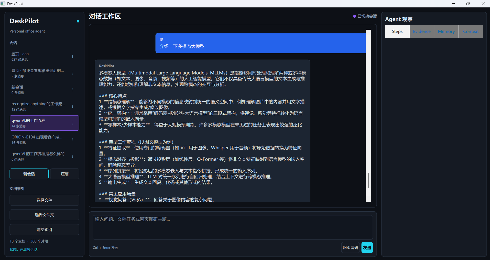
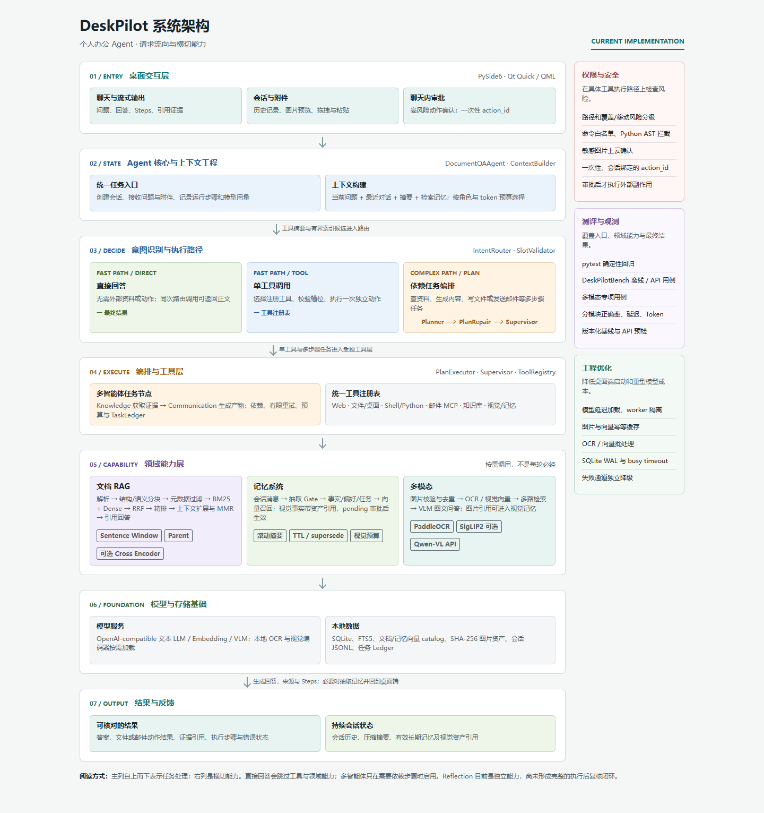

# DeskPilot

> 当前版本：`0.9.0`

DeskPilot 是一个本地优先的多模态桌面办公 Agent，支持文档与图文问答、跨会话记忆、网页调研、邮件和本地文件操作，使用 PySide6 + Qt Quick 构建桌面界面。

简单请求由语义路由器直接回答或调用工具，复杂任务进入 Plan-and-Execute 多智能体流程。计划、证据、工具结果、人工审批和上下文统计均可在界面中查看。

> 当前仍是个人项目和实验性 Demo，不应直接用于无人值守的生产环境，也不应在未检查权限策略的情况下处理重要邮箱或系统文件。

## 界面预览



## 系统架构



主链路是“桌面输入 → 上下文构建 → 意图路由 → 直接回答 / 单工具 / 多步骤计划 → 结果与记忆”。权限审批、评测和工程优化贯穿对应执行路径；图中三条分支并非每轮都会执行。

## 主要能力

### 桌面对话与会话管理

- 支持会话历史、新建、重命名、置顶、删除和导出，以及图片选择、粘贴和拖入。
- 文本与视觉回答支持真实 SSE 增量输出；聊天和 Steps 可滚动、选择和复制，风险操作在聊天内审批。

实现：[`qt_app.py`](deskpilot/qt_app.py)、[`Main.qml`](deskpilot/qml/Main.qml)。

### 意图识别与任务编排

- LLM 将请求分为 `direct_answer`、`tool_call`、`clarify`、`plan_task`，依据注册工具 Schema 选择工具并校验参数。简单问答可复用 Router 回答，跳过 Planner。
- 复杂任务由 Planner 生成依赖图，经过 PlanRepair 校验/修订后，由 PlanExecutor + Supervisor 执行受控节点；已覆盖邮件复合任务、网页写报告、索引报告和多文档摘要，其他路径仍保留兼容执行链。
- Supervisor 管理依赖、有限重试、预算和等待人工确认状态；TaskLedger 记录任务及节点结果。Planner 仅在需要定位文件时接收有数量、目录和 Token 限制的候选列表。
- 提供 Knowledge、Communication、Reflection 等角色组件；Reflection 已有路由入口和审查接口，完整自动质量审查闭环仍待完善。

实现：[`core/`](deskpilot/core/)、[`intent/`](deskpilot/intent/)、[`multi_agent/`](deskpilot/multi_agent/)。

### 本地文档 RAG

支持 `.txt`、`.md`、`.csv`、`.docx`、`.pptx`、`.xlsx` 和 `.pdf`。

```text
结构/语义分块 -> SQLite Catalog + Embedding + FTS5
查询分析/多查询 -> Dense + BM25 -> RRF -> 可插拔精排
Sentence Window/Parent 扩展 -> 覆盖感知 MMR -> 证据回答与引用校验
```

- 结构文档按标题、段落、表格或页分块，非结构文本支持相邻句向量的语义断点与完整句 overlap；索引保存版本、元数据、父块、句子窗口和向量缓存。
- 默认采用精确向量扫描与 SQLite FTS5/BM25 混合检索；复杂查询可触发 Multi-Query，HyDE 默认关闭。精排默认 `lexical`，可选本地 Cross-Encoder 或 API，失败回退 RRF。
- 按问题类型扩展句子窗口或父块，再以相关性、文档/子查询覆盖和 MMR 选择证据。引用校验失败时尝试一次修订；记忆和历史模型回答不能替代文档证据。

实现：[`rag/`](deskpilot/rag/)。

### 会话记忆与上下文工程

- 短期上下文由最近消息和滚动摘要组成；长期记忆保存事实、偏好、决策、待办及产物，使用 SQLite 向量存储或可选 Chroma 检索。
- Memory Gate 控制抽取时机，结合低置信度审批、冲突替代、类型/作用域 TTL 和删除状态管理生命周期。
- ContextBuilder 按角色与任务复杂度分配 Token 预算，通过 Gather → Select → Structure → Compress 选择相关信息，压缩工具输出并保留直接依赖结果。
- 记录 selected/dropped、成本、摘要一致性和上下文质量；文档问答隔离事实型记忆与历史助手回答，降低错误内容回流风险。

实现：[`memory/`](deskpilot/memory/)、[`context/`](deskpilot/context/)。

### 网页搜索与调研报告

- 支持 DuckDuckGo、Bing、Tavily 和 Playwright 搜索/阅读；浏览器可复用本机 Chrome 或 Playwright Chromium。
- 抽取网页正文、去重并构建检索证据，生成带来源链接的 Markdown 调研报告；可与文件、邮件工具组合执行。

实现：[`web_research.py`](deskpilot/rag/web_research.py)。

### 多模态图片问答与检索

- 支持单图/多图 VLM 问答，以及图片和显式 PDF 页图索引；通过 RRF 融合 OCR 关键词、OCR 文本向量和 SigLIP2 视觉向量，提供文本搜图、图搜图与检索增强图文问答。
- 原图、缩略图、元数据与向量分离存储，按 SHA-256 和向量空间复用缓存；PDF 页图在单任务 worker 内受限批处理，资源不足时保留 OCR 通道并标记降级。
- 显式“记住图片”创建待审批视觉记忆，审批后支持跨会话文本及相似图片召回；上下文受文本 Token、图片数量和像素预算约束，删除引用资产需确认级联清理。
- 图片上云默认关闭，剪贴板/截图默认逐次审批；敏感图片和含凭证等信息的图片禁止长期保存，会话只保存资产引用，不保存 Base64。

`knowledge.answer_multimodal` 用于检索与 VLM 综合回答，`knowledge.search_multimodal` 用于查看原始证据或图搜图。可靠文本搜图需启用 SigLIP2，中文图片文字检索需启用 PaddleOCR；详见[多模态模块说明](deskpilot/multimodal/README.md)。

实现：[`multimodal/`](deskpilot/multimodal/)、[`visual_memory.py`](deskpilot/memory/visual_memory.py)。

### 邮件 MCP

- 支持 163、QQ、Outlook 和 Mock Provider，提供最近/未读邮件、线程读取、搜索、分类、摘要、模板正文、草稿与附件发送。
- 使用 IMAP/SMTP 读写邮箱；保存草稿和发送邮件均需确认，发送后尝试同步服务器“已发送”文件夹。当前仅加载一个活动账号。
- Demo 直接复用 MCP 业务层，无需单独启动服务器；外部 MCP Client 可通过 `deskpilot.mcp.email_server` 的 stdio 接入。

实现：[`mcp/`](deskpilot/mcp/)。

### 工具调用与权限安全

- ToolRegistry 统一注册文档定位/读取、TXT/MD/DOCX/PDF 写入、索引、网页、邮件、Python、Windows PowerShell/Linux Shell 及低风险桌面动作。
- Shell 采用白名单、风险分级、工作目录约束和超时；Python 执行需审批，静态检查阻断部分危险语法，但不等同于系统沙箱。
- 安全目录内新建文件通常无需审批；已有文件默认拒绝覆盖，显式 `overwrite=true` 可在安全目录内覆盖。移动文件、工作区外写入、邮件提交及中高风险执行按权限结果审批，受保护系统路径直接阻断。
- 待审批参数保存在应用端，前端仅回传会话绑定、限时、一次性的 `action_id`；模型提供的 `confirm` 不能授予权限。

实现：[`tools/`](deskpilot/tools/)、[`approval.py`](deskpilot/core/approval.py)。

## 测评结果

### 基线与最新运行对照

以下按测试时间区分新旧，版本标签保留报告原值：基线 B 为 **2026-10-09 02:22，报告版本 0.9.1**；最新 L 为 **2026-10-09 21:40，报告及当前代码版本 0.9.0**。两次均使用 `qwen3.8-max` 和 `text-embedding-v4`。L 的固定集列由全量运行结果按 B 的 36 个用例 ID 重新汇总。

| 指标 | B：固定 API 集 | L：相同 ID 固定集 | L：全量 API 集 |
|---|---:|---:|---:|
| 有效样本 / 跳过 | 36 / 0 | 36 / 0 | 146 / 17 |
| Accuracy | 69.44% | 100.00% | **83.56%** |
| 平均 Task Completion | 0.8250 | 0.9931 | **0.9120** |
| Token F1 | 0.2163（n=2） | 0.2163（n=2） | 0.1419（n=4） |
| 未捕获执行错误率 | 0.00% | 0.00% | 0.00% |
| 平均响应时间 | 8.97 s | 10.04 s | 10.85 s |
| P95 响应时间 | 18.62 s | 24.39 s | 25.69 s |
| 平均 Token / 有效样本 | 6,504 | 7,036 | 7,475 |
| 总 Token | 234,151 | 253,303 | 1,091,370 |

B 禁用本地降级，L 允许降级，且两次数据集 SHA-256 不同；相同 ID 不保证用例内容及环境完全一致，因此这是**历史运行对照，不是受控版本提升实验**。固定集质量结果更高，同时耗时和 Token 也更高。网页、邮件等外部依赖部分使用 fixture/mock，不代表真实互联网或私人邮箱上的成功率。

### 最新 API 分模块表现

以下均为 L 全量运行的有效样本，排除跳过项；Token 为各模块全部模型调用的服务端 usage 累计。

| 模块 | 有效样本 | Accuracy | Task Completion | 平均响应 / s | 总 Token |
|---|---:|---:|---:|---:|---:|
| 直接问答 | 13 | 100.00% | 1.0000 | 9.60 | 67,864 |
| 意图路由 | 14 | 85.71% | 0.9583 | 7.31 | 72,384 |
| 文档问答 | 37 | 83.78% | 0.9365 | 13.68 | 258,125 |
| 会话记忆 | 10 | 100.00% | 1.0000 | 9.61 | 97,131 |
| 上下文工程 | 19 | 89.47% | 0.9474 | 14.29 | 271,357 |
| 工具调用 | 14 | 71.43% | 0.8036 | 5.09 | 73,360 |
| 复合操作 | 11 | 90.91% | 0.9091 | 17.06 | 83,088 |
| 多智能体 P0 | 6 | 66.67% | 0.7500 | 14.70 | 45,570 |
| 多智能体 P1 | 5 | 60.00% | 0.7333 | 9.76 | 32,536 |
| 网页调研 | 3 | 100.00% | 1.0000 | 8.87 | 19,501 |
| 安全权限 | 11 | 54.55% | 0.7879 | 4.36 | 55,531 |
| 故障恢复 | 3 | 100.00% | 1.0000 | 4.12 | 14,923 |
| **合计** | **146** | **83.56%** | **0.9120** | **10.85** | **1,091,370** |

Accuracy 是按用例验收规则计算的任务通过比例，Task Completion 是声明断言的完成比例；错误率只统计未捕获执行错误，不等于任务失败率。Token F1 只统计有参考答案的少量用例，不代表开放式问答或意图分类的 Macro-F1。全量集的安全权限、多智能体与工具调用仍是主要改进项。

### 专项数据集与性能

| 数据集 / 测试 | 已记录指标 | 范围与条件 |
|---|---|---|
| RAG P2 检索集，2026-09-20 | 来源 Recall **1.00**；事实项 Recall **1.00**；Precision@K **0.6528**；MRR / nDCG **1.00**；平均 **144 ms** | 12 条合成检索用例，以 lexical 精排为主，含 provider fallback；不等于端到端回答质量 |
| 多模态 P2 离线集，2026-10-09 | 任务 Accuracy **100.00%**；平均 **309 ms** | 22 条中执行 18 条，4 条 VLM 用例跳过；合成图片/fixture，覆盖资产安全、检索和视觉记忆 |
| 固定 VLM API 集，2026-10-09 02:28 | 任务 Accuracy **100.00%**；平均 **5.34 s** | 3 条分级图文问答，真实视觉 API；尚无后续同配置 VLM 对比运行 |
| 本机 Qt Bridge 冷启动 | **7.03 s → 0.96 s** | 模型懒加载；测试含 28 个会话、当前会话 1,580 条历史消息 |
| 本机同图重复入库 | **约 33 s → 49 ms** | SHA-256 + 向量空间缓存命中，不包含首次 OCR/视觉推理成本 |

主数据集含公开数据采样/改编和自建回归用例，属于 DeskPilotBench，不是 GAIA/BFCL 官方榜单成绩；数据说明见 [`eval/dataset/README.md`](eval/dataset/README.md)。其他项目的 CLIP/Qwen 微调指标未计入本项目结果。

数据来源：B 的 `eval/baselines/deskpilot_baseline_v0.9.1_20261009T022038+0800/`，L 的 `eval/runs/deskpilotbench_v0.9.0_api_20261009T214014+0800.jsonl`，以及 `eval/reports/rag_p2_latest.md`、`eval/reports/multimodal_p2_offline.md`。原始报告和运行日志不提交；下方命令可重新生成结果。

## 技术栈

| 模块 | 技术 |
|---|---|
| 语言 | Python 3.11 |
| 桌面 UI | PySide6、Qt Quick、QML |
| LLM / Embedding | OpenAI-compatible HTTP/SSE API，默认示例为 DashScope/Qwen |
| 多模态 | Pillow、OpenAI-compatible VLM、可选 SigLIP2/PaddleOCR |
| 文档解析 | PyMuPDF、pypdf，以及基于 ZIP/XML 的 Office 文档解析 |
| RAG 存储 | JSON 兼容快照、SQLite Catalog、SQLite FTS5/BM25 |
| 记忆存储 | JSONL、SQLite、可选 Chroma |
| 浏览器 | Playwright，可复用 Chrome/Chromium |
| 邮件 | IMAP、SMTP、可选 MCP stdio Server |
| 测试与评测 | pytest、163 条 DeskPilotBench、22 条多模态专项集、固定分级 API 套件、GitHub Actions CI |

当前核心实现没有引入 LangChain、LlamaIndex 或 LangGraph，以便直接观察路由、检索、上下文和 Agent Loop 的内部行为。

## 目录结构

```text
deskpilot/
  context/              # 上下文构建、预算、压缩、成本和质量
  core/                 # Agent 主流程、模型客户端、配置和 Runtime
  intent/               # 语义路由、结构化 Schema 和槽位校验
  mcp/                  # 邮件 MCP 业务层和 stdio Server
  memory/               # 会话、结构化记忆、压缩和向量存储
  multi_agent/          # Planner、Router、Supervisor 和领域 Agent
  multimodal/           # 图片资产、OCR、视觉模型、向量库和融合检索
  qml/                  # Qt Quick 界面
  rag/                  # 解析、分块、索引、检索和网页调研
  tools/                # 工具注册、权限、文件、桌面和执行工具
  qt_app.py             # Qt/Python 桥接层
eval/                   # 评测脚本、数据集、运行明细和报告
tests/                  # 模块和端到端回归测试
run_demo.py             # 桌面 Demo 入口
```

运行时数据默认写入 `data/`，包括索引、会话、记忆、报告和日志。该目录不应提交到版本库。

## 环境要求与安装

- Windows 10/11 或支持 PySide6 的 Linux 桌面环境。
- Python 3.11，推荐使用 Conda。
- 使用在线 LLM、Embedding、搜索或真实邮箱时需要网络连接。
- Playwright Chrome 模式需要本机安装 Chrome。

在项目根目录创建环境：

```powershell
conda create -p .\.conda\deskpilot-py311 python=3.11 -y
conda activate .\.conda\deskpilot-py311
python -m pip install -r requirements.txt
```

也可以不激活环境：

```powershell
.\.conda\deskpilot-py311\python.exe -m pip install -r requirements.txt
```

基础依赖包含 PySide6、requests、PyMuPDF/pypdf、Pillow、Playwright、MCP 和 pytest；本地 OCR、视觉编码和 Cross-Encoder 依赖单独安装。

可选依赖：

```powershell
# Chroma 记忆向量库
python -m pip install "chromadb>=0.5.0"

# Playwright 自带 Chromium；使用本机 Chrome 时通常不需要
python -m playwright install chromium

# 更精确的上下文 Token 统计，可任选其一
python -m pip install tiktoken
python -m pip install transformers

# 多模态本地 OCR 与 SigLIP2；会安装 PaddlePaddle、PyTorch 等大型依赖
python -m pip install -r requirements-multimodal.txt

# 本地 Cross-Encoder 精排；模型目录另行配置
python -m pip install -r requirements-rerank.txt
```

模型默认缓存到各依赖的系统缓存目录。磁盘空间有限时，建议在 `.env` 或系统环境变量中把缓存迁移到空间充足的磁盘，例如：

```env
HF_HOME=D:\broagent\.cache\huggingface
HUGGINGFACE_HUB_CACHE=D:\broagent\.cache\huggingface\hub
PADDLE_HOME=D:\broagent\.cache\paddle
PADDLE_PDX_CACHE_HOME=D:\broagent\.cache\paddlex
```

模型缓存目录、`.env` 和运行时索引均已排除在 Git 之外，不应提交。

## 配置

复制配置模板：

```powershell
Copy-Item .env.example .env
```

`.env` 包含密钥和邮箱凭证，已被 `.gitignore` 排除，禁止提交。

### 模型配置

默认示例使用 DashScope 的 OpenAI-compatible API：

```env
DASHSCOPE_API_KEY=your_api_key
DASHSCOPE_BASE_URL=https://dashscope.aliyuncs.com/compatible-mode/v1
QWEN_MODEL=qwen3.7-plus
QWEN_EMBEDDING_MODEL=text-embedding-v4
QWEN_ENABLE_THINKING=false
ALLOW_LOCAL_FALLBACK=true
```

也兼容通用的 `LLM_API_KEY`、`LLM_BASE_URL`、`LLM_MODEL`、`EMBEDDING_API_KEY`、`EMBEDDING_BASE_URL` 和 `EMBEDDING_MODEL`。

模型 HTTP 请求对 429、502、503、504 和瞬时网络错误默认最多尝试 3 次，并使用指数退避。可通过 `LLM_API_MAX_ATTEMPTS`（1-5）和 `LLM_API_RETRY_BASE_SECONDS` 调整。

未配置 API Key 时，文档索引可降级为本地 hash embedding，RAG 回答降级为证据摘要；通用知识问答仍需要可用 LLM。

### RAG 与记忆配置

```env
MEMORY_VECTOR_PROVIDER=auto
CONTEXT_TOKENIZER_PROVIDER=auto
RAG_CHUNKING_POLICY=adaptive
RAG_HYBRID_ENABLED=true
RAG_MULTI_QUERY_ENABLED=true
RAG_HYDE_ENABLED=false
RAG_DENSE_PROVIDER=exact
RAG_DENSE_MIN_SCORE=0.08
RAG_P2_ENABLED=true
RAG_RERANK_PROVIDER=lexical
RAG_CONTEXT_EXPANSION_ENABLED=true
RAG_FINAL_TOP_K=6
RAG_MMR_LAMBDA=0.72
```

- `MEMORY_VECTOR_PROVIDER` 可设为 `auto`、`sqlite` 或 `chroma`。
- `RAG_HYBRID_ENABLED=false` 可回退到旧检索路径。
- 当前 Dense Provider 为小规模知识库的精确扫描，不是 ANN 向量数据库。
- `RAG_P2_ENABLED=false` 可回退到 P1 RRF；`RAG_RERANK_PROVIDER=disabled` 只关闭精排。
- `cross_encoder` 不会自动下载模型，必须在 `RAG_RERANK_MODEL` 配置本地模型目录。
- 完整分块、窗口、批处理和 RRF 参数见 `.env.example`。
- `CONTEXT_TOKENIZER_PROVIDER=auto` 对 Qwen 等 OpenAI-compatible 模型使用轻量保守估算，避免 Demo 启动时导入 Transformers/Torch；准备好本地 tokenizer 后可显式设置为 `transformers`。

### 多模态配置

```env
VISION_PROVIDER=openai_compatible
VISION_MODEL=qwen-vl-max-latest
VISION_BASE_URL=https://dashscope.aliyuncs.com/compatible-mode/v1
VISION_API_KEY=
ALLOW_CLOUD_IMAGE_UPLOAD=false
SENSITIVE_IMAGE_POLICY=confirm

OCR_PROVIDER=paddleocr
OCR_DETECTION_MODEL=PP-OCRv5_mobile_det
OCR_RECOGNITION_MODEL=PP-OCRv5_mobile_rec
OCR_USE_TEXTLINE_ORIENTATION=false
OCR_ENABLE_MKLDNN=false
OCR_CPU_THREADS=1
OCR_ISOLATED_PROCESS=true

IMAGE_EMBEDDING_PROVIDER=siglip2
IMAGE_EMBEDDING_MODEL=google/siglip2-base-patch16-224
IMAGE_EMBEDDING_ISOLATED_PROCESS=true
IMAGE_EMBEDDING_BATCH_SIZE=8
IMAGE_EMBEDDING_MIN_AVAILABLE_COMMIT_GB=5
MULTIMODAL_RETRY_MISSING_VISION=false
```

- `VISION_MODEL` 必须选择服务商实际支持图片输入的型号；上云需开启 `ALLOW_CLOUD_IMAGE_UPLOAD=true`。`SENSITIVE_IMAGE_POLICY=confirm` 默认要求剪贴板/截图单次审批，也可设为 `block` 或 `allow`。
- Windows 默认 OCR 单线程、关闭文字方向分类与 MKLDNN；OCR/SigLIP2 使用隔离 worker 和受限批大小。首次推理包含模型加载成本，缓存命中时复用结果。
- 提交内存不足时保留 OCR、跳过视觉向量；资源充足后可设置 `MULTIMODAL_RETRY_MISSING_VISION=true` 补算。OCR 文本无 Embedding API 时标记为本地 hash fallback。

### 网页搜索配置

```env
SEARCH_PROVIDER=duckduckgo
SEARCH_API_KEY=
SEARCH_ENDPOINT=
RESEARCH_MAX_RESULTS=5
BROWSER_CHANNEL=chrome
BROWSER_HEADLESS=true
BROWSER_TIMEOUT_MS=30000
SEARCH_ENGINE=bing
```

`SEARCH_PROVIDER` 支持 `duckduckgo`、`bing`、`tavily` 和 `playwright`。Bing/Tavily 需要对应 API Key；DuckDuckGo 和网页抓取的可用性受网络及站点反爬策略影响。

### 邮箱配置

本地开发建议先使用：

```env
EMAIL_PROVIDER=mock
```

QQ 邮箱示例：

```env
EMAIL_PROVIDER=qq
EMAIL_USERNAME=your_name@qq.com
EMAIL_PASSWORD=your_authorization_code
EMAIL_MAILBOX=INBOX
EMAIL_DRAFTS_MAILBOX=Drafts
EMAIL_SENT_MAILBOX=Sent
EMAIL_IMAP_PORT=993
EMAIL_SMTP_PORT=465
```

`EMAIL_PROVIDER` 还支持 `163` 和 `outlook`。163/QQ 的 `EMAIL_PASSWORD` 应填写客户端授权码，不是网页登录密码；需先在网页版邮箱开启 IMAP/SMTP。不同邮箱的草稿箱和已发送文件夹名称可能不同，应按服务器实际名称调整。

### 工具权限配置

```env
TOOL_SAFE_ROOTS=
TOOL_COMMAND_TIMEOUT_SECONDS=30
EMAIL_ATTACHMENT_MAX_MB=20
EMAIL_ATTACHMENTS_TOTAL_MAX_MB=25
```

`TOOL_SAFE_ROOTS` 使用分号分隔；为空时默认使用项目根目录和 `data/workspace`。扩大安全根目录会降低确认频率，也会扩大文件操作风险。

## 启动

```powershell
.\.conda\deskpilot-py311\python.exe run_demo.py
```

启动后可以：

1. 选择单个文件或文件夹建立本地索引。
2. 在聊天区进行通用问答、文档问答或自然语言工具调用。
3. 在 Steps 中检查 Router、Planner、Query Analyzer、检索 Trace 和工具结果。
4. 在 Evidence 中核对文件名、PDF 页码或网页链接。
5. 对写文件、执行命令、保存草稿和发送邮件等操作进行人工确认。
6. 添加图片进行直接图文问答，或通过自然语言将图片/PDF 页图加入多模态索引。

只有外部 MCP Client 需要单独启动邮件 Server：

```powershell
.\.conda\deskpilot-py311\python.exe -m deskpilot.mcp.email_server
```

## 测试

完整回归和编译检查：

```powershell
.\.conda\deskpilot-py311\python.exe -m pytest tests -q
.\.conda\deskpilot-py311\python.exe -m compileall -q deskpilot eval tests
```

DeskPilotBench 离线模式不会调用真实模型、网页或邮箱：

```powershell
.\.conda\deskpilot-py311\python.exe -m eval.run_eval --count 163 --mode offline
```

离线模式用于确定性逻辑与回归检查，不能替代模型能力测评。完整基线包含 36 个测试模块、163 条主离线用例、22 条多模态离线用例、36 条分级文本 API 和 3 条分级 VLM API：

```powershell
.\.conda\deskpilot-py311\python.exe -m eval.run_baseline `
  --project-version 0.9.0 `
  --api-suite baseline_api_v0.9.0 `
  --multimodal-api-suite baseline_multimodal_api_v0.9.0 `
  --compare-baseline .\eval\baselines\deskpilot_baseline_v0.9.1_20261009T022038+0800 `
  --change-summary "修复API基线中的路由、计划和工具执行问题" `
  --change-summary "完成多模态P2视觉记忆、审批和跨会话召回"
```

完整基线会消耗真实 LLM、Embedding 和 VLM API 配额，并强制禁用本地 fallback；网页资料、邮件副作用使用 fixture/mock，不实际发信。需配置三类模型并开启 `ALLOW_CLOUD_IMAGE_UPLOAD=true`，VLM 输入为合成测试图片。对比目录需在本机存在，首次运行可去掉 `--compare-baseline`；`--project-version` 应与待测版本一致。报告按版本和带时区时间戳写入 `eval/baselines/`。

真实 API 全量、固定集或单例（`.env` 设置 `ALLOW_LOCAL_FALLBACK=false` 后可按严格模式复测）：

```powershell
.\.conda\deskpilot-py311\python.exe -m eval.run_eval --count 163 --mode api
.\.conda\deskpilot-py311\python.exe -m eval.run_eval --suite baseline_api_v0.9.0 --mode api
.\.conda\deskpilot-py311\python.exe -m eval.run_eval --case-id reg_rag_route_005 --mode api
```

API 模式先检查 LLM/Embedding 连接，运行中持续连接或限流失败会熔断。评测进度与逐例结果持续写入 `eval/runs/`、`eval/reports/`，详见 [`eval/README.md`](eval/README.md)。

RAG 检索层消融：

```powershell
.\.conda\deskpilot-py311\python.exe -m eval.run_rag_p0_eval --count 8
.\.conda\deskpilot-py311\python.exe -m eval.run_rag_p1_eval --mode offline --strategy all
.\.conda\deskpilot-py311\python.exe -m eval.run_rag_p2_eval --count 12 --mode offline --provider auto --expansion auto
```

多模态专项测试与评测：

```powershell
.\.conda\deskpilot-py311\python.exe -m pytest tests\test_multimodal_p0_p1.py -q
.\.conda\deskpilot-py311\python.exe -m pytest tests\test_multimodal_memory_p2.py -q
.\.conda\deskpilot-py311\python.exe -m eval.run_multimodal_eval --mode offline --count 22 --report eval\reports\multimodal_v0.9.0_offline.md
# 需要配置视觉 API，并明确允许上传测试图片
.\.conda\deskpilot-py311\python.exe -m eval.run_multimodal_eval --mode api --suite baseline_multimodal_api_v0.9.0 --report eval\reports\multimodal_v0.9.0_api.md
```

GitHub Actions 使用 Python 3.11 执行完整 pytest、163 条主集的数量/唯一 ID 校验，以及确定性离线 smoke；全量能力集不作为零失败 CI 门禁。`eval/dataset/*.jsonl` 和小型合成 fixture 是版本化测试输入，原始运行结果与个人数据不提交。

## 数据与安全

- `.env`、邮箱密码、授权码和 API Key 不得提交。
- `data/` 包含本地索引、会话、记忆和用户文档派生产物，不得提交。
- 会话持久化会脱敏常见密码、Token、API Key 字段，审批审计只保存参数名称和有限结果摘要；邮件正文、命令和文件内容仍可能出现在普通对话中，应按敏感本地数据保护 `data/`。
- `eval/runs/`、`eval/reports/` 和会话导出可能包含用户问题、绝对路径或模型输出，不得提交。
- 高风险工具虽然有权限控制，但仍应在隔离目录和非重要账号上验证。
- LLM 生成的计划、命令、邮件正文和文件内容在确认前仍需人工检查。

## 当前局限

- 文本和视觉索引使用精确扫描，适合个人小型知识库；Office 内嵌图、后台索引队列和 ANN 尚未完成。
- `basic` 视觉向量与 hash 文本向量仅用于降级验证；首次 OCR/SigLIP2 推理有冷启动与内存成本，PDF 字体映射异常仍可能导致乱码。
- Cross-Encoder 需自行提供本地权重；ColBERT 当前为 hash MaxSim 接口实验，并非训练版 ColBERT。
- 多智能体仍有兼容执行路径，Reflection 尚无完整自动审查闭环；审批后重放的敏感图片调用尚未流式返回。
- 网页受网络和反爬策略影响；邮箱仅支持单活动账号，Outlook OAuth 和多账号隔离待完成。
- 执行安全依赖应用权限和静态检查，尚无完整系统沙箱；本地 fallback 不能替代真实模型推理。
- 尚未在本项目接入 SFT、RLHF/DPO、Agentic RL 训练、vLLM 或端侧生成模型；独立训练实验不计为已集成功能。

## 后续工作

- RAG：校准各 reranker 阈值，使用真实中英文 Cross-Encoder 做消融，并在知识库规模增长后接入成熟 ANN Provider。
- 多模态：继续完善会话孤立资产回收，并开发 Office 内嵌图、后台任务队列、ANN 和端侧 VLM。
- Agent：按任务质量要求启用 Reflection，并完善失败恢复、预算和人工接管。
- 邮件：多账号、OAuth、模板管理、附件策略和更完整的邮箱文件夹兼容。
- UI：补齐审批重放流式输出、计划图和工具审批历史。
- 评测：先在相同数据、模型和降级策略下复测基线，再扩充参考答案、真实复合任务与多模态标注，完善 F1/Recall、成本和稳定性对比。
- 模型工程：在数据和评测稳定后尝试 SFT、偏好优化、推理加速与端侧部署。

## License

当前仓库尚未添加开源许可证。在添加明确的 `LICENSE` 前，请勿假设代码可以被任意复制、修改或再分发。
